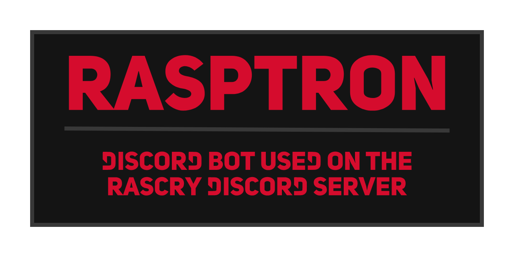

> **Note:** This is a development repository, if you want to use this for a production environment please use the [RASCRY Installer](https://github.com/RASCRY/installer).

# About RASPTron
RASPTron is the Discord Bot used on the [RASCRY Discord Server](). <!--- REPLACE TO https://discord.rascry.org ONCE SETUP-->

# Help us
Want to help us? Email us at [contribute@rascry.org](mailto:contribute@rascry.org).

# License
RASPTron is open-sourced software licensed under a [Modified MIT license](LICENSE).